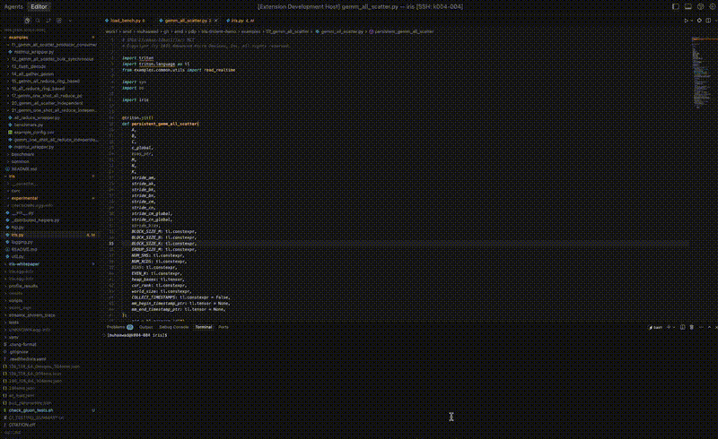

# Trident 🔱

<p align="center">
  
</p>

**Navigate Triton GPU assembly with bidirectional source-assembly highlighting and powerful inspection tools.**

## 🎥 Demo

<p align="center">
  
</p>

## 📦 Installation

### Download Latest Version

[](https://github.com/maawad/trident/actions/workflows/main.yml)

1. Go to [Actions](https://github.com/maawad/trident/actions)
2. Click on the latest successful workflow run
3. Scroll to "Artifacts" and download `trident-vsix`
4. Extract the `.vsix` file from the zip
5. In VS Code: `Extensions` → `...` → `Install from VSIX`
6. Select the downloaded `.vsix` file

### From Open VSX

[](https://open-vsx.org/extension/TinkerCode/trident)

Visit [Open VSX](https://open-vsx.org/extension/TinkerCode/trident) to download the `.vsix` file.

## 🚀 Quick Start

1. Open a Python file with Triton kernels (`@triton.jit`)
2. Right-click → `Trident: Show GCN Assembly` or click the chip icon in the toolbar
3. Click source lines to highlight assembly, click assembly to jump to source

## ✨ Features

- **Bidirectional Highlighting**: Click source ↔ assembly to navigate
- **Assembly Viewer**: Side-by-side view with syntax highlighting
- **Advanced Filtering**: Hide directives, comments, filter by instruction type
- **In-Webview Search**: Press `Ctrl+F` to search assembly
- **Version Comparison**: Compare different kernel versions side-by-side
- **Smart Cache**: Auto-detects `~/.triton/cache` (configurable)

## ⚙️ Configuration

Set custom cache directory in VS Code settings:

```json
{
  "trident.cacheDirectory": "~/custom/triton/cache"
}
```

## 🔧 Development

```bash
npm install
npm run compile
npm run lint
```

Press `F5` in VS Code to debug.

## 📝 License

MIT License - see [LICENSE](LICENSE) for details.

---

**Made with 🔱 for GPU kernel developers**
